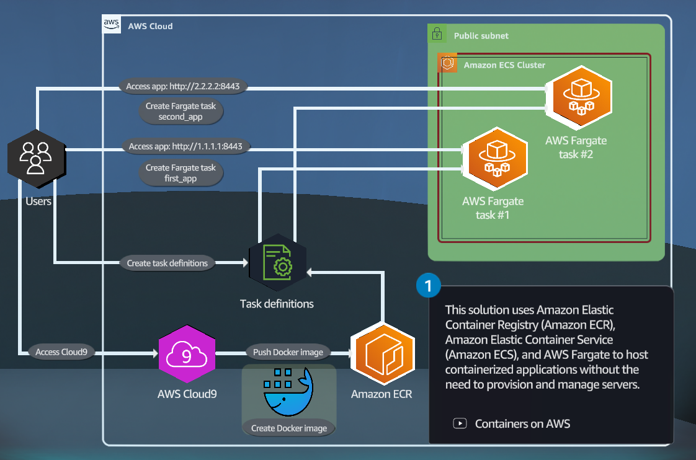

Deployement of containerized application in AWS Using Amazon ECS
----------------------------------------------------------------

Use Amazon ECS, Amazon ECR, and Amazon fargate to deploy containerized applications.

- Amazon ECR is an AWS managed container image registery that is secure, scalable, and reliable. You can store, share and deploy your container software anywhere
- Fargate is a quick way to launch and run containers on AWS. AWS Fargate is a technology that you can use with amazon ECS to run container without having to mange servers or clusters of EC2 instances.
- Creat a Task definition and a Task; it describe how one or more containers should launched. A task is the instance of the task definition

# TODO: Readme still in progress...
